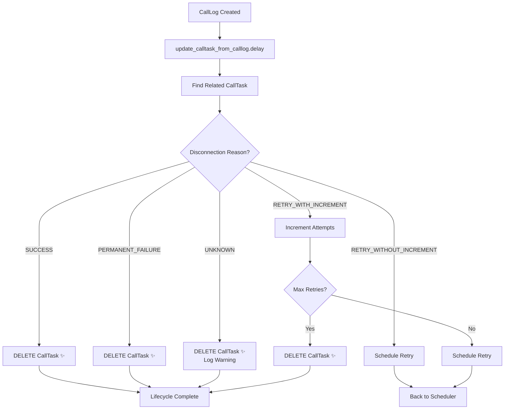

# 🔄 CallTask Lifecycle Documentation

## Overview

This document describes the complete lifecycle of CallTask objects in the HotCalls system, from creation to deletion. The CallTask system manages automated call scheduling, execution, and retry logic with a feedback loop that processes call outcomes.

## 🎯 Core Principles

- **One CallLog = One CallTask**: Each call log affects only its corresponding call task
- **Clean Database**: No orphaned records - all CallTasks either retry appropriately or get deleted
- **Agent Configuration Compliance**: All retry timing respects agent-specific settings
- **Bulletproof Fallback**: Unknown disconnection reasons safely delete tasks to prevent database pollution

---

## 🌟 Happy Path: Successful Call

### 1. CallTask Creation
```
Lead Created → API Call to POST /api/call-tasks/ 
→ CallTask.objects.create(
    lead=lead,
    agent=agent, 
    phone=lead.phone,
    status=SCHEDULED,
    next_call=timezone.now(),
    attempts=0
)
```

### 2. Call Scheduling & Execution
```
schedule_agent_call (Celery periodic task - runs every few seconds)
→ Find SCHEDULED tasks where next_call <= now
→ Check agent capacity limits
→ Atomic UPDATE: SCHEDULED → CALL_TRIGGERED
→ trigger_call.delay(call_task.id)
```

### 3. Call Triggering
```
trigger_call Celery task
→ Atomic guard check: status == CALL_TRIGGERED
→ UPDATE: CALL_TRIGGERED → IN_PROGRESS  
→ _make_call_async(agent, phone)
→ LiveKit/SIP call initiated successfully
```

### 4. Call Execution (OutboundAgent)
```
Outbound Agent starts
→ User answers phone
→ Natural conversation occurs
→ User or Agent ends call normally
→ send_call_log_request() called
→ POST /api/calls/call-logs/ with disconnection_reason="user_hangup"
```

### 5. CallLog Creation & Feedback Loop
```
CallLogViewSet.perform_create()
→ CallLog.objects.create(disconnection_reason="user_hangup")
→ Record call duration in quota system
→ update_calltask_from_calllog.delay(call_log.id) [NON-BLOCKING]
```

### 6. Feedback Processing (Happy End)
```
Celery: update_calltask_from_calllog task
→ find_related_calltask() → Matches by lead+agent+phone
→ disconnection_reason="user_hangup" in SUCCESS_DISCONNECTION_REASONS
→ call_task.delete() ✨
→ LIFECYCLE COMPLETE - CallTask removed from system
```

---

## 🔄 Retry Path: User Rejection/Busy

### Divergence Point: User Doesn't Answer
```
Call attempt made → User doesn't answer or line is busy
→ send_call_log_request() with disconnection_reason="dial_no_answer"
→ CallLog created with failure reason
→ update_calltask_from_calllog.delay() triggered
```

### Retry Processing (WITH Attempt Increment)
```
find_related_calltask() → Found matching CallTask
→ disconnection_reason="dial_no_answer" in RETRY_WITH_INCREMENT_REASONS
→ handle_retry_with_increment(call_task, call_log)
  → call_task.increment_retries(agent.max_retries)
  → IF attempts < max_retries:
    → attempts++ (0→1)
    → status = RETRY
    → next_call = calculate_next_call_time(agent, now)
    → Respect agent.retry_interval, workdays, call_from/call_to
    → CallTask saved for next attempt
  → ELSE (attempts >= max_retries):
    → call_task.delete() ✨
    → LIFECYCLE COMPLETE - Max retries reached
```

### Return to Scheduling Loop
```
schedule_agent_call (next run)
→ Finds CallTask with status=RETRY, next_call <= now
→ RETRY → CALL_TRIGGERED → trigger_call.delay()
→ Cycle repeats until success or max retries
```

---

## ⚠️ Technical Failure Path: System Issues

### Divergence Point: Technical Problem
```
Call attempt made → System error occurs
→ Examples: SIP routing failure, LLM websocket error, audio issues
→ send_call_log_request() with disconnection_reason="sip_routing_error"
→ CallLog created with technical failure reason
```

### Technical Retry Processing (WITHOUT Attempt Increment)
```
find_related_calltask() → Found matching CallTask
→ disconnection_reason="sip_routing_error" in RETRY_WITHOUT_INCREMENT_REASONS
→ handle_retry_without_increment(call_task, call_log)
  → DON'T increment attempts (stays at current value)
  → status = RETRY
  → next_call = calculate_next_call_time(agent, now)
  → CallTask saved for retry
→ Infinite retries for technical issues (not user's fault)
```

---

## 🛑 Permanent Failure Path: Hopeless Cases

### Example: Invalid Phone Number
```
Call attempt made → Invalid destination detected
→ send_call_log_request() with disconnection_reason="invalid_destination"
→ CallLog created with permanent failure reason
→ update_calltask_from_calllog.delay() triggered
```

### Permanent Failure Processing
```
find_related_calltask() → Found matching CallTask
→ disconnection_reason="invalid_destination" in PERMANENT_FAILURE_REASONS
→ process_calltask_feedback():
  → call_task.delete() ✨
  → Log: "CallTask deleted - permanent failure"
→ LIFECYCLE COMPLETE - No point retrying
```

---

## 🚨 Unknown Disconnection Reason: Bulletproof Fallback

### New/Unclassified Reason Received
```
Call attempt made → New disconnection reason from Retell AI
→ send_call_log_request() with disconnection_reason="new_unknown_reason"
→ CallLog created with unclassified reason
→ update_calltask_from_calllog.delay() triggered
```

### Fallback Processing (Safe Delete)
```
find_related_calltask() → Found matching CallTask
→ disconnection_reason="new_unknown_reason" NOT in any classification list
→ FALLBACK SAFETY MECHANISM:
  → call_task.delete() ✨
  → logger.warning("MISSING DISCONNECTION REASON CLASSIFICATION: new_unknown_reason")
  → logger.warning("⚠️ Update calltask_utils.py to add proper classification")
→ LIFECYCLE COMPLETE - Database protected from pollution
```

---

## 💥 Error Paths & Recovery Scenarios

### A. Call Triggering Fails (LiveKit Issues)
```
trigger_call task executes
→ _make_call_async() returns {"success": False}
→ IF attempts < max_retries:
  → increment_retries() → attempts++
  → status = RETRY  
  → next_call = now + retry_interval
  → Scheduled for retry
→ ELSE (max retries reached):
  → increment_retries() → call_task.delete() ✨
  → LIFECYCLE COMPLETE
```

### B. Agent Crashes (No CallLog Created)
```
Call triggered → Agent process starts → Agent crashes before sending CallLog
→ CallTask remains in IN_PROGRESS state indefinitely
→ cleanup_stuck_call_tasks (periodic Celery task)
  → Finds IN_PROGRESS tasks older than 30 minutes
  → Deletes stuck CallTask ✨
  → LIFECYCLE COMPLETE - Cleanup recovery
```

### C. CallTask Not Found (Edge Case)
```
CallLog created for manual/test call → update_calltask_from_calllog.delay()
→ find_related_calltask() returns None (no matching CallTask)
→ Log: "No CallTask found - likely manual/test call"
→ Feedback task completes successfully (no action needed)
→ Normal behavior for non-scheduled calls
```

### D. Feedback Task Fails (Celery/Database Issues)
```
update_calltask_from_calllog task encounters exception
→ Celery retry mechanism activates
→ Exponential backoff: 60s, 120s, 240s
→ After 3 failures: permanent failure logged
→ CallTask remains in IN_PROGRESS state
→ cleanup_stuck_call_tasks will eventually recover
```

---

## 🎯 All Possible CallTask End States

| End State | Trigger | Lifecycle Stage |
|-----------|---------|-----------------|
| ✅ **DELETED** | Successful call | Feedback loop (SUCCESS_DISCONNECTION_REASONS) |
| ✅ **DELETED** | Max retries reached | Retry logic (increment_retries() limit) |
| ✅ **DELETED** | Permanent failure | Feedback loop (PERMANENT_FAILURE_REASONS) |
| ✅ **DELETED** | Unknown reason | Feedback loop (bulletproof fallback) |
| 🧹 **DELETED** | Stuck task cleanup | Recovery mechanism (system failure) |
| ♾️ **RETRY** | Technical failures | Infinite retry loop (system issues) |

**Key Improvement: NO MORE WAITING STATE! All failed scenarios now delete cleanly.**

---

## 📊 Disconnection Reason Classifications

### 🎉 SUCCESS_DISCONNECTION_REASONS → DELETE
Call completed successfully, task no longer needed:
- `USER_HANGUP` - User ended call normally
- `AGENT_HANGUP` - Agent ended call normally  
- `CALL_TRANSFER` - Call was transferred successfully
- `VOICEMAIL_REACHED` - Message left on voicemail

### 🔄 RETRY_WITH_INCREMENT_REASONS → Retry with attempts++
Real attempts where user actively didn't respond/declined:
- `DIAL_BUSY` - Line was busy
- `DIAL_FAILED` - Call failed to connect
- `DIAL_NO_ANSWER` - No one answered
- `USER_DECLINED` - User actively declined call
- `MARKED_AS_SPAM` - User marked as spam

### 🗑️ PERMANENT_FAILURE_REASONS → DELETE
Situations where retrying will never succeed:
- `INVALID_DESTINATION` - Invalid phone number
- `TELEPHONY_PROVIDER_PERMISSION_DENIED` - Permission denied
- `NO_VALID_PAYMENT` - Account/billing issue
- `SCAM_DETECTED` - Call detected as scam
- `ERROR_USER_NOT_JOINED` - User never joined call

### 🔄 RETRY_WITHOUT_INCREMENT_REASONS → Retry without attempts++
Technical/system issues that aren't the user's fault:
- `INACTIVITY` - Call timeout due to inactivity
- `MAX_DURATION_REACHED` - System limit reached
- `CONCURRENCY_LIMIT_REACHED` - System overload
- `ERROR_NO_AUDIO_RECEIVED` - Audio system failure
- `ERROR_ASR` - Speech recognition error
- `SIP_ROUTING_ERROR` - Network/routing issue
- `TELEPHONY_PROVIDER_UNAVAILABLE` - Provider down
- `ERROR_LLM_WEBSOCKET_*` - LLM connection issues
- `ERROR_HOTCALLS` - HotCalls system error
- `ERROR_UNKNOWN` - Unknown system error
- `REGISTERED_CALL_TIMEOUT` - System timeout

### 🚨 UNKNOWN_REASONS → DELETE (Fallback)
Any disconnection reason not classified above gets safely deleted to prevent infinite retries.

---

## 🔧 Agent Configuration Integration

The CallTask system respects agent-specific configuration throughout the lifecycle:

### Configuration Fields
- **retry_interval** (minutes): Time between retry attempts (default: 30)
- **max_retries** (integer): Maximum attempts for user rejections (default: 3)  
- **workdays** (JSON array): Valid days for calling (e.g., ['monday', 'tuesday'])
- **call_from** (time): Start of calling hours (default: 09:00)
- **call_to** (time): End of calling hours (default: 17:00)

### Smart Scheduling Example
```
Failed call at 2024-01-15 18:30 (Monday)
→ agent.retry_interval = 30 minutes
→ agent.call_to = 17:00 (5 PM)
→ Base next_call = 19:00 (outside calling hours)
→ ensure_valid_call_time() adjusts to:
→ next_call = 2024-01-16 09:00 (Tuesday morning at call_from time)
```

### Configuration Compliance Points
1. **Retry Timing**: All retries respect retry_interval
2. **Workday Validation**: Calls only scheduled on configured workdays
3. **Hour Constraints**: Calls only scheduled within call_from to call_to
4. **Max Attempts**: User rejection retries limited by max_retries
5. **Technical Retries**: Infinite for system issues (not user's fault)

---

## 🔬 Monitoring & Observability

### Key Metrics to Track
- CallTask creation rate
- Successful completion rate (deletions via SUCCESS_DISCONNECTION_REASONS)
- Retry rates by disconnection reason
- Max retry deletions (user exhaustion)
- Permanent failure deletions
- Unknown reason fallback triggers
- Stuck task cleanup events

### Log Messages to Monitor
```
# Successful completions
"CallTask {id} deleted - successful call ({reason})"

# Max retries reached
"CallTask {id} deleted - max retries ({max}) reached"

# Permanent failures  
"CallTask {id} deleted - permanent failure ({reason})"

# Unknown reasons (requires action)
"⚠️ MISSING DISCONNECTION REASON CLASSIFICATION: {reason}"

# Retry scheduling
"CallTask {id} scheduled for retry at {time} (attempt {n})"

# Stuck task recovery
"🧹 Deleted stuck tasks: {n} CALL_TRIGGERED, {n} IN_PROGRESS"
```

---

## 🚀 Implementation Files

### Core Components
- **`core/models.py`**: CallTask model with increment_retries() method
- **`core/tasks.py`**: Celery tasks for scheduling and feedback processing
- **`core/utils/calltask_utils.py`**: Feedback logic and disconnection reason classifications
- **`core/management_api/call_api/views.py`**: CallLog creation triggers feedback

### Key Functions
- **`schedule_agent_call()`**: Periodic scheduler for CallTasks
- **`trigger_call()`**: Individual call execution
- **`update_calltask_from_calllog()`**: Feedback loop processor
- **`find_related_calltask()`**: CallTask matching by lead+agent+phone
- **`process_calltask_feedback()`**: Main disconnection reason handler
- **`calculate_next_call_time()`**: Agent configuration-aware scheduling

---

## 🔄 Feedback Loop Architecture



This comprehensive lifecycle ensures robust call management with proper retry logic, agent configuration compliance, and zero orphaned database records! 🎉
